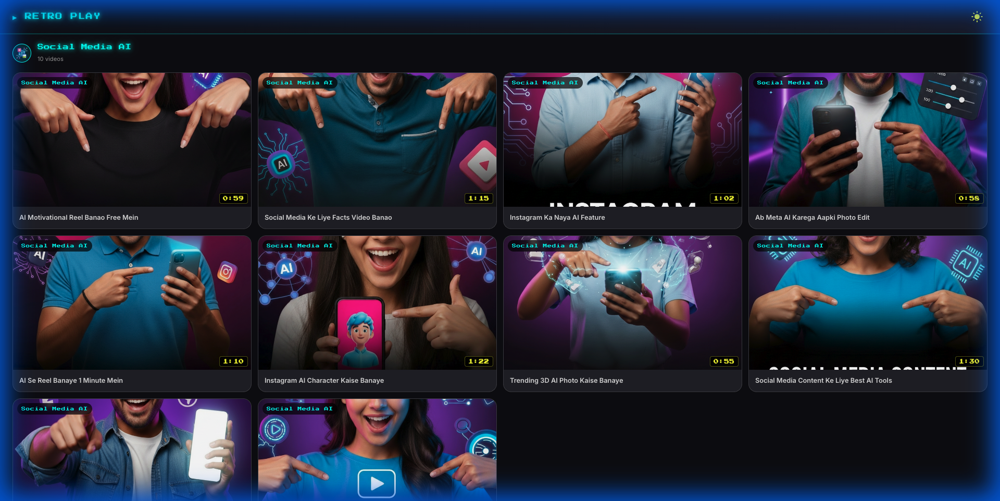
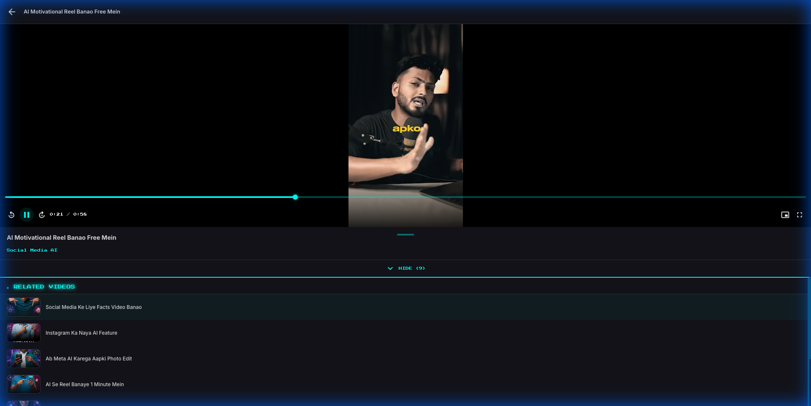
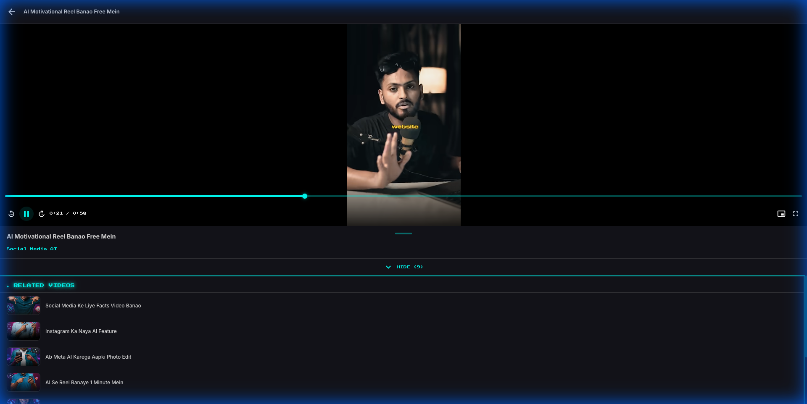
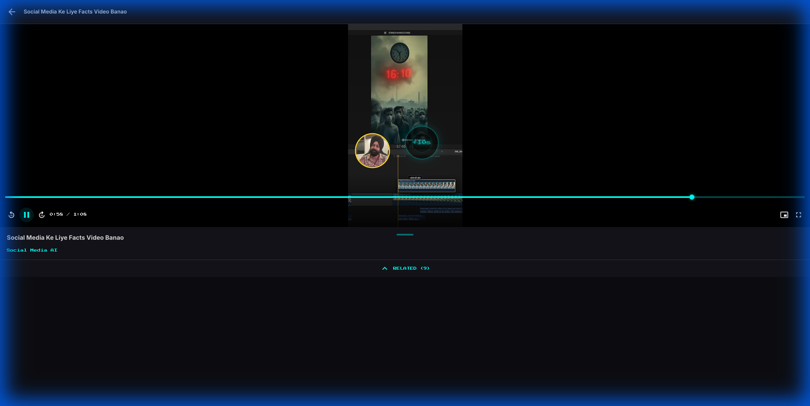
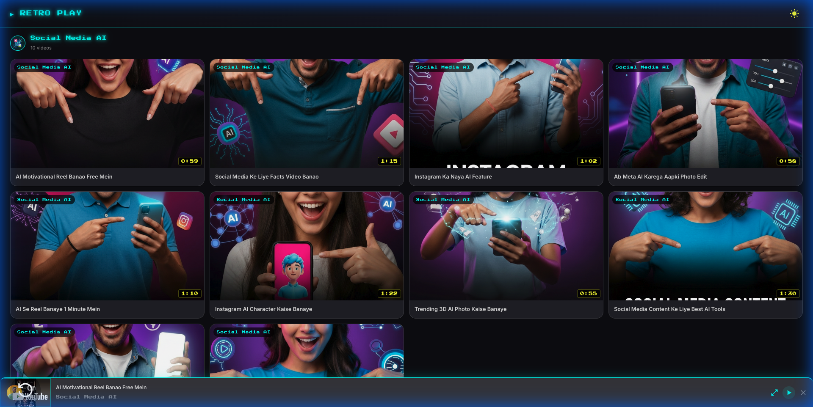

# 🎬 Retro Play — Video Player

A feature-rich, mobile-first video player built with **React + TypeScript + Vite**. Streams YouTube content with custom controls, mini player, keyboard shortcuts, auto-play, and more.

🔗 **Live Demo:** [video-player-3.vercel.app](https://video-player-3.vercel.app/)
📦 **GitHub Repo:** [github.com/Yashwanth-Brahma/video-player](https://github.com/Yashwanth-Brahma/video-player)

---

## 📸 Screenshots

### Home Page
Browse videos by category with thumbnails, titles, and durations — responsive grid layout.



### Video Player with Controls
Full player view with custom control bar, video title, category tag, and related videos list.



### Player Controls
Custom control bar with skip ±10s, play/pause, progress bar, time display, PiP, and fullscreen.



### Skip Feedback Animation
Visual ripple animation showing `+10s` / `-10s` in the center when skipping.



### Mini Player
Minimize to continue browsing while the video keeps playing in a docked mini player at the bottom.



---

## ✨ Features

### 🎮 Custom Video Controls
- Play/Pause, Seek ±10s, Progress bar with drag
- Time display (current / duration)
- Controls auto-hide after 3 seconds of inactivity

### ⌨️ Keyboard Shortcuts
| Key | Action |
|-----|--------|
| `Space` | Play / Pause |
| `←` Arrow Left | Skip back 10 seconds |
| `→` Arrow Right | Skip forward 10 seconds |

### 🔄 Skip Feedback Animation
- Centered ripple animation with glowing cyan ring
- Shows `+10s` or `-10s` label with scale & fade effect

### ⏭️ Auto-Play Next Video
- 2-second countdown overlay when a video ends
- Shows next video's thumbnail and title
- **Play Now** (instant) and **Cancel** buttons
- Automatically advances through videos in the same category

### 🖼️ Picture-in-Picture (PiP)
- PiP button in the control bar
- Uses the Browser PiP API with graceful fallback
- Auto-hidden on browsers that don't support PiP

### 📱 Mini Player
- Minimize to a docked bottom bar while browsing
- Shows video thumbnail, title, and category
- Play/Pause, Expand, and Close controls
- Video continuity preserved (resumes from where you left off)

### 🔲 Fullscreen
- Standard fullscreen on desktop and Android
- CSS-based pseudo-fullscreen for iOS Safari & Chrome (uses `100dvh`)
- Adapts to browser toolbar height to prevent clipping

### 📂 Related Videos
- Expandable related videos list below the player
- Click any related video to switch instantly
- Open by default — tap **HIDE** to collapse

### 🌙 Dark Theme
- Full dark mode with retro-styled neon cyan accents
- Smooth gradient backgrounds and glassmorphism cards

### 📱 Mobile First
- Responsive grid layout (1–4 columns depending on screen size)
- Touch-friendly controls and gestures
- Optimized for iOS Safari, iOS Chrome, and Android

---

## 🛠️ Tech Stack

| Technology | Purpose |
|------------|---------|
| **React 19** | UI framework |
| **TypeScript** | Type safety |
| **Vite** | Build tool & dev server |
| **Material UI (MUI)** | Component library |
| **Framer Motion** | Animations & transitions |
| **Zustand** | State management |
| **YouTube IFrame API** | Video playback |

---

## 🚀 Getting Started

```bash
# Clone the repo
git clone https://github.com/Yashwanth-Brahma/video-player.git
cd video-player

# Install dependencies
npm install

# Start dev server
npm run dev
```

Open [http://localhost:5173](http://localhost:5173) in your browser.

### Production Build

```bash
npm run build
npm run preview
```

---

## 📁 Project Structure

```
src/
├── components/
│   ├── VideoPlayer.tsx    # Core player with YouTube API, controls, shortcuts
│   ├── MiniPlayer.tsx     # Docked mini player bar
│   ├── RelatedVideos.tsx  # Related videos list
│   ├── VideoCard.tsx      # Video thumbnail card
│   └── ThemeToggle.tsx    # Dark/light mode toggle
├── pages/
│   ├── HomePage.tsx       # Video grid with categories
│   └── PlayerPage.tsx     # Full player view + auto-play overlay
├── store/
│   └── usePlayerStore.ts  # Zustand store for player state
├── data/
│   ├── dataset.json       # Video metadata
│   └── videoData.ts       # Data helpers + getNextVideo()
└── types.ts               # TypeScript interfaces
```

---

## 📄 License

MIT
